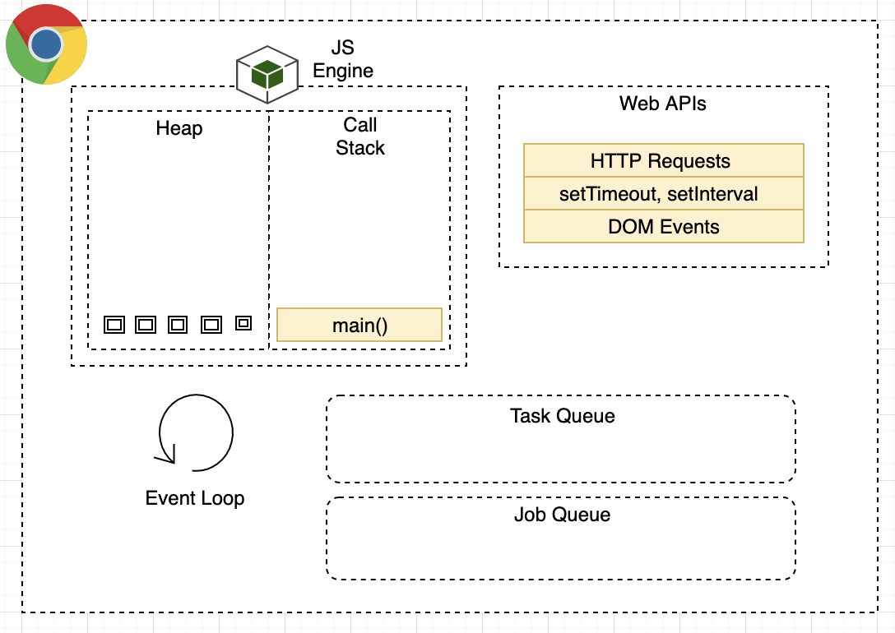

# Asynchronous JavaScript Concepts by [Gorakh](https://gorakhjoshi.com)

In this module you will learn following concepts

- [x] XMLHttpRequest API and Callback Hell
- [x] Promises and Consuming Promises
- [x] Chaining Promises
- [x] Handling Rejected Promises
- [x] Throwing Error in Asynchronous Operation
- [x] Role of Event Loop in Asynchronous JavaScript
- [x] Building Promise Yourself
- [x] Async Await
- [x] Immediately Invoked Function Expression
- [x] Running Promises in Parallel
- [x] Promise Combinators
